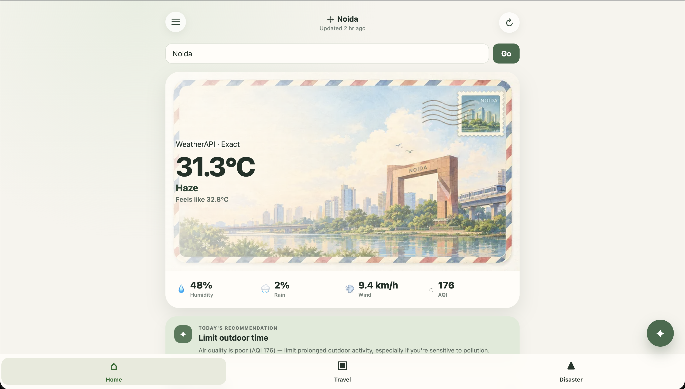
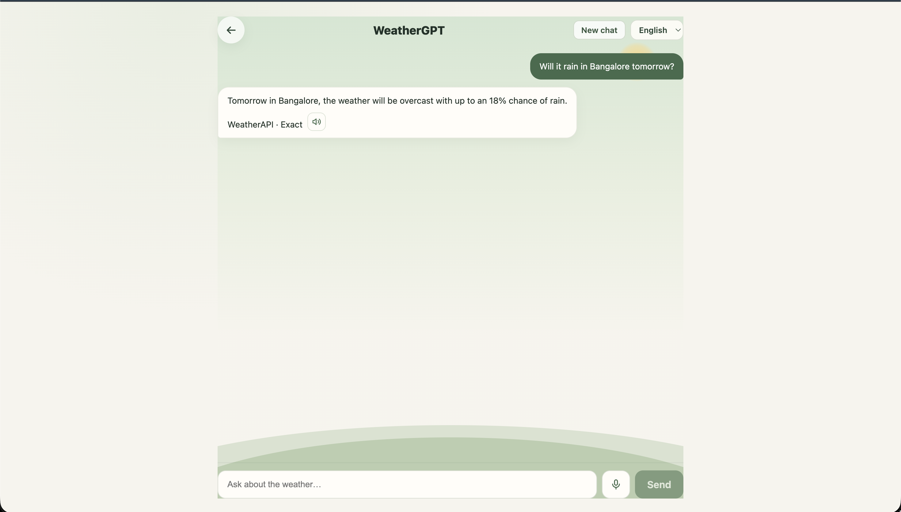
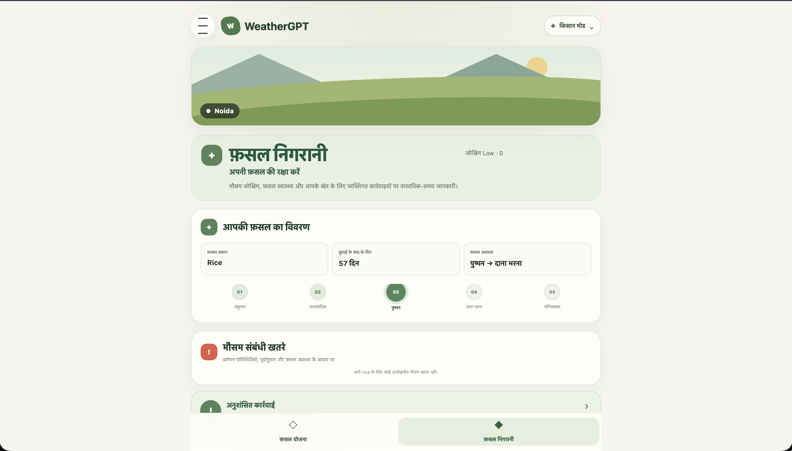
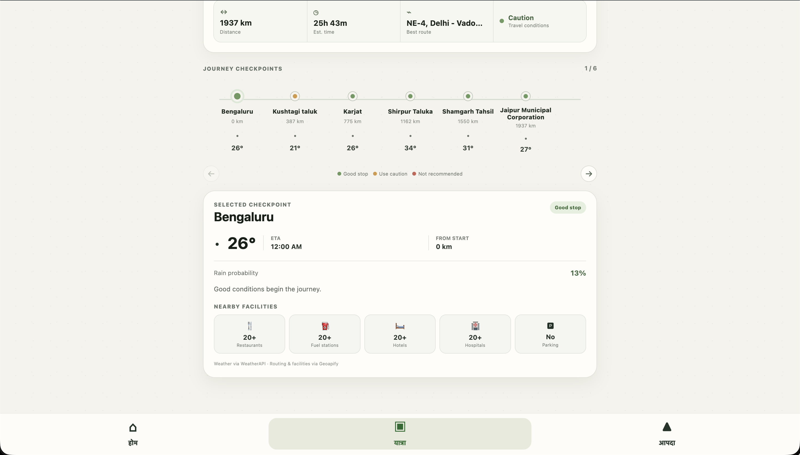
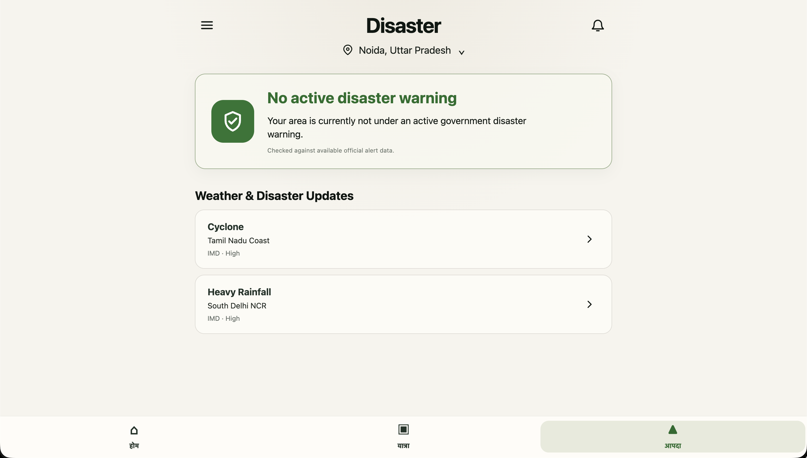
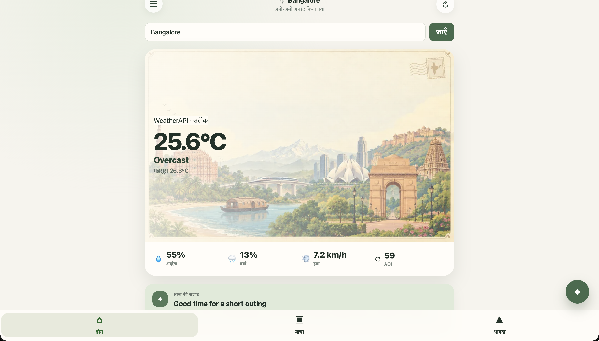

# WeatherGPT — SIH 2026

**Problem Statement ID:** SIH26068

**Title:** WeatherGPT: Conversational AI for Weather Forecasting, Alerts, and Climate Information

**Theme:** Disaster Management · **Category:** Software

WeatherGPT is a grounded, proactive, role-aware weather-intelligence platform for IMD/MoES. It turns live weather data, forecasts, alerts, and curated domain rules into clear conversational guidance, including multilingual and voice-enabled access.

## Live demo

- **App (frontend):** https://weathergpt-sih2026-frontend.onrender.com
- **API (backend):** https://weathergpt-sih2026.onrender.com

> The backend runs on a free tier that sleeps after inactivity, so the **first request may take ~40–60 seconds to wake the server** — the page loads instantly, and live weather appears once the server is up (refresh if needed).

## Problem statement

Weather data is spread across portals, bulletins, satellite products, and forecast systems. Individuals, farmers, travellers, and disaster stakeholders need fast, contextual, actionable answers rather than raw data alone.

## Proposed solution

WeatherGPT combines a React web application with a FastAPI service. It retrieves live forecast data through a fail-safe source ladder, grounds conversational answers in verified data, supports Indian languages and browser voice features, and provides dedicated Farmer, Travel, and Disaster workflows.

## Key features

- Live current conditions and hourly forecasts with graceful fallbacks
- Grounded, multi-turn conversational weather assistance
- Multilingual UI and voice input/output
- Farmer Mode: crop planning and crop-watch advisories
- Route-aware travel planning and disaster-awareness views
- Traceable data provenance and an API test suite in continuous integration

## Screenshots

| Home | Grounded chat | Farmer Mode |
|------|---------------|-------------|
|  |  |  |

| Travel planner | Disaster view | Multilingual (Hindi) |
|----------------|---------------|----------------------|
|  |  |  |

More views in [`assets/screenshots/`](assets/screenshots/).

## Technology stack

- **Frontend:** React, Vite, Vitest
- **Backend:** Python, FastAPI, Pytest
- **Data/services:** WeatherAPI, Open-Meteo, Nominatim, Geoapify; optional Gemini/Groq for answer phrasing
- **Deployment:** Render

## Architecture and documentation

- [Architecture overview](docs/architecture.md)
- [Architecture and build plan](docs/SIH26068_WeatherGPT_Architecture_and_Build_Plan.md)
- [Feature brief](docs/SIH26068_WeatherGPT_Feature_Brief.md)
- [Deployment notes](docs/DEPLOYMENT.md)
- [Presentation deck (Google Slides)](https://docs.google.com/presentation/d/135J9qX9mrWnsX3U3k_naLwAHGtMaTZAV/edit?usp=sharing)
- [Submission checklist](SUBMISSION_GUIDE.md)

## Team

Add each official team member and their contribution before submitting.

| Name | Role / contribution |
| --- | --- |
| _Add team member_ | _Add role_ |

## Quick start — backend

```bash
cd backend
python3 -m venv .venv && source .venv/bin/activate   # or your preferred venv tool
pip install -r requirements.txt
cp .env.example .env    # fill in real values, never commit this file
pytest -v                # confirm the test suite passes before you start
uvicorn app.main:app --reload
```

Then visit `http://localhost:8000/` for the health check,
`http://localhost:8000/weather/Delhi` to see the degradation ladder in action,
or `http://localhost:8000/docs` for the auto-generated API docs. `POST /chat`
answers natural-language questions (grounded); set `GEMINI_API_KEY` in `.env` for
LLM-phrased answers, otherwise it returns a deterministic grounded answer.

## Quick start — frontend

```bash
cd frontend
npm install
npm run dev      # Vite dev server (usually http://localhost:5173)
npm test         # Vitest suite
npm run build    # production build
```

Set `VITE_API_BASE_URL` (see `frontend/.env.example`) to point at the backend;
it defaults to `http://localhost:8000`. On the Home screen, enter a location and
it fetches live weather from the backend's `/home/{location}` endpoint.
