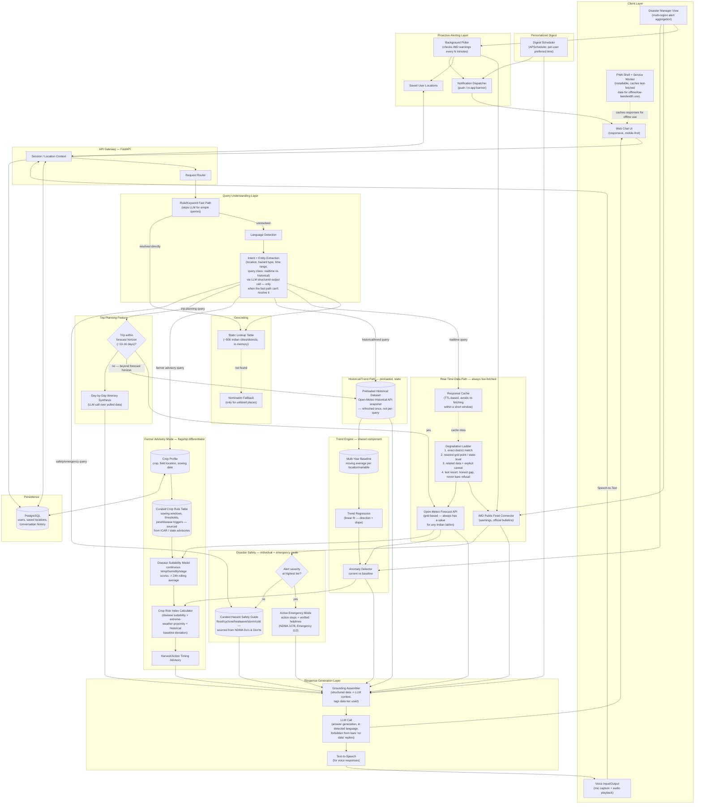

# WeatherGPT — Architecture & Execution Plan
### SIH 2026 · Problem Statement SIH26068 · Software Track

---

## 1. Problem Statement Reference

| Field | Detail |
|---|---|
| **PS ID** | SIH26068 |
| **Title** | WeatherGPT: Conversational AI for Weather Forecasting, Alerts, and Climate Information |
| **Organizing Body** | Ministry of Earth Sciences (MoES) |
| **Department** | India Meteorological Department (IMD) |
| **Theme** | Disaster Management |
| **Category** | Software |

### 1.1 Background (as stated in the PS)

Weather information today is distributed across multiple portals, bulletins, satellite products, and forecast systems, making it difficult for common users, researchers, disaster managers, and government agencies to quickly obtain actionable insights. There is a need for an intelligent conversational platform that can provide real-time weather information, forecasts, warnings, climate analysis, and decision support in natural language.

### 1.2 Objective (as stated in the PS)

Develop an AI-powered chatbot platform named **WeatherGPT** that integrates meteorological datasets, forecasting models, and disaster warning systems to provide accurate, contextual, and multilingual weather intelligence through conversational interfaces.

### 1.3 Key Features Called Out in the PS

1. Real-time weather information retrieval
2. Natural language querying for weather forecasts
3. Integration with numerical weather prediction (NWP) models such as GFS/WRF
4. Extreme weather alerts and early warning dissemination
5. Location-based forecasting and advisory generation
6. Multilingual support for Indian languages
7. Climate trend and historical weather analysis
8. Voice-enabled interaction for rural accessibility

### 1.4 Expected Solution (as stated in the PS)

- A mobile-based conversational AI platform
- Backend integration with meteorological databases, websites, and APIs
- An AI/LLM-based query understanding engine
- Scalable architecture supporting real-time data ingestion

### 1.5 Suggested Technology Stack (as stated in the PS)

Python / FastAPI / Node.js · MQTT / WIS2.0 / WebSocket · LLMs (OpenAI, Llama, Gemini, etc.) · GIS tools and weather APIs · PostgreSQL / MongoDB · Docker / Kubernetes

### 1.6 Official Evaluation Parameters

Accuracy and relevance · Response latency · Multilingual capability · UI and accessibility · Scalability and innovation · Integration with real-time meteorological systems · Voice-enabled interaction for rural accessibility

---

## 2. What We Are Actually Going to Build

The PS is written at ministry/production scale — true GFS/WRF model integration, WIS2.0/MQTT infrastructure, and Kubernetes deployment are not realistic or expected inside a 36-hour build, and no judge evaluating a student prototype expects them. Our job is to build the **thinnest version that is still honest and complete against every evaluation parameter**, not the literal maximal brief.

**Positioning, stated plainly:** WeatherGPT is not "a chatbot that tells you the weather." On a single one-off question, a generic LLM with web search can already do that about as well as we can, and pretending otherwise is a losing argument in front of a judge who pushes on it. The actual product is **a grounded, proactive, role-aware decision-support system that uses conversation as its interface** — the value sits in the data engineering, persistence, and domain logic wrapped around the model, not in the model itself. Section 2.1 makes this case explicitly, because it's the question most likely to come up in evaluation and the team needs a precise, honest answer ready.

**Our scoped MVP, in one sentence:** *A grounded, retrieval-augmented conversational assistant — with a general-purpose core and a deep, purpose-built Farmer Advisory mode as its flagship differentiator — that answers natural-language weather questions in English and at least one Indian language, using real public weather/alert data, with voice input/output and proactive severe-weather alerting.*

**What we explicitly will NOT attempt**, and why that's a defensible scoping call, not a shortcut:
- Live GFS/WRF numerical model runs — these are raw output meant for meteorologists; we consume forecast *products* derived from them (via IMD/public APIs), not raw model grids.
- True WIS2.0/MQTT protocol integration — we simulate the "real-time alert" behavior with a polling job, which satisfies the *functional* requirement without needing WMO's actual message-broker infrastructure.
- Kubernetes/production deployment — a single deployed instance (Render/Railway/a cloud VM) demonstrates the same architecture without the operational overhead.

**Why this framing wins on the actual evaluation parameters:** every one of the seven official criteria (accuracy, latency, multilingual, UI/accessibility, scalability *and innovation*, real-time integration, voice) is satisfiable by the MVP above. None of the criteria explicitly require raw NWP model integration — "integration with real-time meteorological systems" is satisfied by live API integration with IMD/public weather sources.

### 2.1 Differentiation: Why Not Just Use a Regular Weather App, or a Generic LLM Directly

This is the single most important question the team needs a sharp answer to, so it's stated here explicitly rather than left implicit.

| Capability | Regular weather app | Generic LLM (ChatGPT/Gemini) | WeatherGPT |
|---|---|---|---|
| Natural-language Q&A | No | Yes | Yes |
| Voice interaction | Partial (device-level only) | Yes | Yes |
| Multilingual | Limited | Yes | Yes |
| Proactively pushes an alert without being asked | Sometimes (basic push) | **No — purely reactive, only responds when opened** | **Yes — background poller watches saved locations** |
| Persistent profile tied to a specific field/crop/location, accumulating value over time | No | **No — each chat starts cold unless the user re-explains everything** | **Yes — structured farmer/user profile** |
| Curated, sourced domain rules (crop-stage thresholds, pest triggers) | No | **No — generates a plausible-sounding answer from general training, not a cited agri-extension rule** | **Yes — explicit rule table sourced from ICAR/state advisories** |
| Traceable "which official source is this from" | No | **No — web search results are a black box to the user** | **Yes — `data_tier` tagging traces explicitly to IMD/Open-Meteo** |
| Repeatable, explainable computed score (not a fresh guess each time) | No | No | **Yes — Crop Risk Index, same formula every time** |
| Designed for low-bandwidth/low-literacy rural access | No | No (assumes smartphone + data plan + typical app fluency) | **Yes — purpose-built** |

**The argument to make to a judge, precisely:** we are not claiming a novel AI capability — a generic LLM already covers the top three rows, and pretending otherwise is a losing position. The claim is that turning a general-purpose model into a *reliable, proactive, domain-aware system* requires real systems engineering — persistence, sourced domain rules, background monitoring, auditable grounding — and that engineering, not the chat interface, is the actual product. This is also why the Farmer Advisory mode (Section 2.2, Sprint 3) is the flagship feature rather than a side addition: it is the concrete demonstration of exactly this argument, since a generic chatbot can tell a farmer it might rain, but cannot tell them their wheat is at grain-filling stage, humidity is trending toward fungal-disease risk, and they should harvest before Thursday — unless someone builds that logic and feeds it in.

### 2.2 Personas

The platform stays genuinely general-purpose at its core (satisfying the PS's literal brief of serving "individuals, researchers, disaster managers, and government agencies"), while going deep on one persona as the standout feature:

| Persona | Role in the product | Depth |
|---|---|---|
| **General individual** | Baseline conversational Q&A — current conditions, forecasts, alerts | Table-stakes; satisfies the brief, not the differentiator |
| **Traveler / trip planner** | Multi-day itinerary-aware planning (Sprint 3) | Moderate depth — a genuine feature, not just a query type |
| **Farmer (flagship persona)** | Dedicated dashboard: crop-specific advisory, risk scoring, sowing/harvest guidance (Sprint 3) | Deep, curated, sourced — this is the standout |
| **Disaster manager / government stakeholder** | Severity-sorted Disaster Manager view with Trend Engine context (Section 3.9) | Real dedicated UI now, though still the least user-validated persona — the team has no real access to actual government workflows to design against |
| **General individual, during an active alert** | Hazard-specific safety guidance and, at the highest severity tier, Active Emergency Mode (Section 3.9) | Curated, NDMA-sourced — the second-most safety-critical feature in the product after grounding itself |

**On whether this is scope creep away from the PS:** it isn't, provided the framing stays disciplined. The PS is issued by MoES/IMD as a *general* conversational platform, not an agriculture-ministry brief — and there are separate SIH problem statements this year specifically about crop disease and farmer market linkage. Pitching this as "we built a farming app" would read as drift from the assigned brief. Pitching it as *"WeatherGPT is a general conversational weather-intelligence platform for IMD; here is a deep-dive into one stakeholder group — farmers — to show what 'actionable insight' actually looks like beyond a forecast"* satisfies the literal brief while still delivering the hard-to-copy differentiation a generic weather chatbot can't touch.

### 2.3 Timeline Context: 12–13 Day Internal-Round Build

Everything above still holds — the differentiation argument, the persona structure, the scoping discipline. What changes is how much depth is achievable, and the plan below (Section 4) is rebuilt around days instead of hours accordingly.

**Working assumption on capacity:** 12–13 calendar days with a team of 5–6, realistically averaging some effective focused hours per person per day rather than continuous work — closer to a part-time sprint than a hackathon grind, since the team likely has classes/other commitments running in parallel. In raw person-hours this isn't wildly more than a 36-hour hackathon crammed across a whole team, but the *distribution* changes everything: there's room for research (sourcing real ICAR data instead of guessing), testing, iteration, sleep, and recovering from a wrong turn without it being fatal to the whole submission. That's what genuinely raises the ceiling here — not more hours, but hours that don't have to be spent in crisis mode.

**What this timeline newly makes feasible, beyond the hackathon-scoped plan:**

- **A wider, better-sourced crop list** (8 crops instead of 3–5 — see Section 4, Sprint 3) since there's time to actually research ICAR/GKMS advisory data properly rather than picking whichever crops are fastest to guess at.
- **A third language**, and doing multilingual support properly (tested across all three, not just demoed in one) rather than a single flawless language plus a risky bonus.
- **A genuine offline/PWA layer** — this is worth calling out specifically because it directly serves the PS's own "rural accessibility" framing: caching the last-fetched forecast/advisory client-side so the app remains useful on a spotty connection, installable as a home-screen PWA without needing an app store. This was explicitly out of scope for a 36-hour build; it's a strong, on-theme addition now.
- **A lightweight Disaster Manager / Stakeholder view** — an aggregated, multi-region view of active alerts (reusing the same alerting backend, just a different front-end lens), which more concretely satisfies the PS's explicit mention of "disaster managers and government agencies" than the general chat interface alone does.
- **A deeper Crop Risk Index** — incorporating the preloaded historical dataset as a baseline (e.g., "5°C above the 10-year average for this date, which raises heat-stress risk for this crop stage") rather than only current-forecast thresholds. Still arithmetic, not machine learning — just a richer formula with more inputs, which the extra research time actually supports.
- **Real automated testing and CI** — a small `pytest` suite for the degradation ladder, risk-index calculator, and connectors (mocked), wired into GitHub Actions so tests run on every push. This is a genuine engineering-maturity signal to judges and costs nothing.
- **Auto-generated API documentation** (FastAPI's built-in OpenAPI/Swagger UI) — essentially free once the backend is built cleanly, and a nice concrete artifact to show alongside the demo.
- **A real bug-bash/QA pass and multiple rehearsals**, which a 36-hour timeline structurally can't afford — this alone tends to matter more for how a demo actually lands than any single extra feature.

**What should stay out of scope even with the extra time, deliberately:**

- **Image-based pest/disease diagnosis.** It's tempting to add given the Farmer Advisory mode's momentum, but it's meaningfully a different, well-defined SIH problem statement's territory (crop disease detection via computer vision) — adding it dilutes the "we are WeatherGPT, a weather-intelligence platform" positioning from Section 2.1 rather than strengthening it. If the team wants this direction, it's a stronger case for switching PS entirely, not folding it in here.
- **Real SMS/IVR delivery.** It's on-theme for rural accessibility, but genuine SMS sending isn't free at any meaningful volume (Twilio and equivalents run out of trial credit fast), which conflicts with the team's own zero-cost constraint. A demo-only mockup of what an SMS alert *would* look like is fine to mention as a future-work slide; don't build live sending infrastructure around it.
- **True production infrastructure** (Kubernetes, WIS2.0/MQTT, raw GFS/WRF integration) — the reasoning from Section 2 (main body) still applies; more calendar time doesn't change what's realistically gradeable or necessary in a student prototype, and building toward infrastructure nobody will evaluate is time better spent on Section 2.3's actual additions above.

---

## 3. System Architecture

### 3.1 Architecture Diagram



### 3.2 Component Breakdown

| Layer | Component | Responsibility | Suggested tools | Cost |
|---|---|---|---|---|
| Client | Web Chat UI | Chat interface, location picker, alert banner | React or plain HTML/JS + Tailwind | Free |
| Client | Voice I/O | Mic capture, playback | Browser Web Speech API | Free, runs client-side, no server call |
| Client | PWA + service worker | Installable app shell (cache-first), IndexedDB local-first storage, a template-based offline responder for common queries, Background Sync for queued requests — see Section 3.6 for the full layered strategy | Web app manifest + Service Worker API + IndexedDB + Background Sync API | Free |
| Client | Disaster Manager view | Aggregated multi-region alert view for the stakeholder persona; reuses the alerting backend, just a different lens | Same frontend framework, separate route/tab | Free |
| Gateway | FastAPI backend | Routes requests, manages session/location context | Python + FastAPI | Free (self-hosted) |
| NLU | Rule/keyword fast path | Resolves simple, well-formed queries (city name + "weather") without an LLM call | Plain Python string/regex matching | Free, and cuts LLM call volume substantially |
| NLU | Language detection | Detects query language | `langdetect` lib, or folded into the LLM call below when one is needed | Free |
| NLU | Intent/entity extraction | Pulls location, hazard type, time range, and query class (realtime vs. historical) from free text — only invoked when the fast path can't resolve the query | LLM call with structured JSON output (function calling) | Free tier (Gemini Flash / Groq) |
| Geocoding | Static lookup table | Place name → lat/lon for ~500 major Indian cities/districts, held in memory | A preloaded JSON/dict, built once | Free, zero external calls for most queries |
| Geocoding | Nominatim fallback | Only invoked when a place isn't in the static table | OpenStreetMap Nominatim | Free, generous usage policy |
| Retrieval (real-time) | IMD connector | Pulls official forecasts/bulletins/active warnings | IMD public data endpoints / bulletin pages | Free |
| Retrieval (real-time) | Open-Meteo connector | Grid-based forecast data — always returns a value for any Indian coordinate, no true "no data" case | Open-Meteo Forecast API (no key) | Free, ~10,000+ calls/day |
| Retrieval (real-time) | Degradation ladder | Steps district → state/region → related-data-with-caveat → honest gap, before ever reaching the LLM with nothing | Plain Python | Free |
| Retrieval (real-time) | Response cache | Short-TTL cache so repeated queries for the same location don't re-fetch | In-memory dict, or a Postgres table | Free |
| Retrieval (historical) | Preloaded historical dataset | Trend/climate-analysis queries only — fetched once ahead of time, not per-query | Open-Meteo Historical Weather API snapshot | Free, one-time pull |
| Generation | Grounding assembler | Formats retrieved data (real-time or historical) into a factual context block, tagged with which data tier was used | Plain Python — the anti-hallucination step | Free |
| Generation | LLM call | Generates the final natural-language answer, forbidden from bare "no data" replies | Gemini Flash free tier, or Groq | Free tier |
| Generation | LLM response cache | Caches full grounded answers for repeated/similar queries, cutting LLM call volume further | Same cache store as above | Free |
| Farmer Advisory | Crop profile | Persistent per-user crop, field location, sowing date | Postgres table | Free |
| Farmer Advisory | Curated crop rule table | Sowing windows, ideal stage-thresholds, pest/disease triggers for 8 crops, sourced from ICAR/GKMS advisories | Static JSON/CSV, hand-curated | Free |
| Farmer Advisory | Disease Suitability Model | Continuous 0–1 temperature/humidity/growth-stage scores per crop-disease pair (bell-curve/ramp functions, not binary thresholds), averaged over a rolling 24h window | Plain Python arithmetic — not ML; see Section 3.7 | Free |
| Farmer Advisory | Crop Risk Index calculator | Combines the Disease Suitability score with extreme-weather proximity and the Trend Engine's historical-baseline deviation into one 0–100 score | Plain Python arithmetic | Free |
| Farmer Advisory | Harvest/action timing advisory | Combines forecast + rule table into a concrete recommendation | Plain Python, feeds into grounding assembler | Free |
| Trend Engine | Multi-year baseline | Moving average per location/variable from the preloaded historical dataset | Plain Python / pandas | Free |
| Trend Engine | Trend regression | Direction + slope of a variable over available years (e.g. monsoon onset drifting later) | `numpy.polyfit` — basic stats, not ML | Free |
| Trend Engine | Anomaly detector | Compares current season vs. baseline; feeds the Risk Index, the Trip Planner's far-future estimate, and Trend-Informed Advisory | Plain Python; shared across three features | Free |
| Trip Planning | Forecast-horizon router | Routes to live forecast (≤~10-16 days out) or historical baseline (further out) | Plain Python date comparison | Free |
| Trip Planning | Itinerary synthesis | LLM call that turns a week of pulled data into a coherent day-by-day note | Same LLM API as Generation layer | Free tier |
| Disaster Safety | Curated Hazard Safety Guide | Do's/don'ts for flood, cyclone, heatwave, thunderstorm/lightning, cold wave — sourced from NDMA's published guidance | Static JSON, hand-curated, cited | Free |
| Disaster Safety | Active Emergency Mode | Triggers at highest alert severity; shows immediate action steps + a verified helpline block (NDMA 1078, pan-India Emergency 112); explicitly flags that district control-room numbers must be looked up per location, not hardcoded | Plain Python severity check + curated content | Free |
| Personalization | Digest scheduler | Per-user scheduled job assembling a personalized daily summary (forecast/alerts/crop advisory/trend comparison per saved preferences) and delivering via push or queued Background Sync | APScheduler, reuses the grounding assembler | Free |
| Generation | TTS | Converts answer to speech for voice mode | Browser Web Speech API (TTS) | Free, client-side |
| Alerting | Poller | Periodically checks IMD warnings against saved locations — no LLM involved, pure comparison logic, so it's unconstrained by any LLM rate limit | Simple cron-style background task (APScheduler) | Free |
| Alerting | Notification dispatcher | Pushes alerts to users with a matching saved location | In-app banner (core); browser Notification API (stretch) | Free |
| Persistence | PostgreSQL | Users, saved locations, conversation history, cache | Supabase/Neon free tier | Free |
| Quality | Automated test suite | Unit tests for degradation ladder, risk-index calculator, connectors (mocked) | `pytest` | Free |
| Quality | CI pipeline | Runs the test suite on every push | GitHub Actions | Free |
| Quality | API documentation | Auto-generated interactive API docs | FastAPI's built-in OpenAPI/Swagger UI | Free |

### 3.3 Why This Shape

The single most important design decision is the **grounding assembler** between retrieval and generation. It exists specifically to stop the LLM from hallucinating a forecast — the LLM never gets to invent weather data; it only ever rephrases data you already fetched and verified. This is also your strongest talking point with judges on the "accuracy and relevance" evaluation criterion, since it's a concrete, explainable safeguard rather than a vague "we used AI" claim.

The second most important decision is that **the LLM is not on the critical path for every query.** The rule/keyword fast path, the static geocoding table, and the alert poller all work without touching the LLM at all — which is what keeps the system inside free-tier limits and keeps latency low, both of which are explicit evaluation criteria.

---

## 3.4 Handling Data Gaps: the Degradation Ladder

The instinct to worry about "I don't have sufficient data" is right for a naively-built system, but it's fixable by design, not by prompt-tuning alone.

**Why most weather queries won't hit a real gap at all:** Open-Meteo is grid-based, not station-based — it interpolates from global NWP model output (ECMWF, GFS, ICON, etc.) at roughly 1–11km resolution, so it has *some* value for literally any coordinate in India. There's no village or district where a lat/lon lookup returns nothing. The genuine gaps are narrower than they first appear: IMD-specific products (district-level cyclone bulletins) that don't cover every sub-district, deep historical queries at very fine granularity, and off-topic questions.

**The fix is a retrieval design that degrades gracefully instead of failing binary.** Before the grounding assembler ever hands the LLM a query, it steps down through tiers:

1. **Exact match** — district-level IMD data for the exact location/metric asked about
2. **Nearest available** — Open-Meteo's grid value for that coordinate, or state/regional-level IMD data if district-level isn't available
3. **Related data + explicit caveat** — e.g., "no active cyclone warning specifically for your district, but the regional advisory for [state] shows..."
4. **Honest gap, as a true last resort** — paired with whatever adjacent data *is* available, never a bare refusal with nothing else offered

The final LLM prompt should explicitly forbid a bare "I don't have sufficient data" response and require the model to state which tier it's answering from. In a live demo, this turns a potential weak point into a strength: you can show a judge a query that visibly degrades gracefully instead of failing, which reads as stronger engineering than a system that either always mysteriously succeeds or fails ungracefully.

**Real-time data vs. historical/trend data are architecturally separate, on purpose.** Current conditions and forecasts must always be freshly fetched or short-TTL cached — never preseeded, since stale current-conditions data is actively wrong. But the PS's "climate trend and historical analysis" feature is not time-sensitive by definition, so a preloaded historical dataset (pulled once via Open-Meteo's Historical Weather API, not re-fetched per query) is the *correct* design choice there, not a shortcut. Splitting these two paths, and being able to explain why each one is built the way it is, is worth stating explicitly to judges — it shows the team understands which data needs to be live and which doesn't, rather than treating "the AI layer" as one undifferentiated blob.

---

## 3.5 Cost & Rate-Limit Strategy

**Target: $0 to build and run through the full hackathon and demo.** The rate-limit risk sits almost entirely on the LLM calls, not the weather data — Open-Meteo's free tier (~10,000+ calls/day, no key required) is not a realistic constraint at hackathon-demo scale.

| Risk | Mitigation |
|---|---|
| LLM free-tier rate limit (e.g., Gemini Flash ≈15 requests/min) | Route simple, well-formed queries (city name + "weather") through the rule/keyword fast path instead of an LLM call — this alone can cut LLM call volume by half or more |
| Repeated identical/similar queries during demo or judging | Cache full grounded LLM responses, not just raw weather data, so a second "weather in Delhi today" doesn't trigger a second LLM call |
| Background alert poller running up against limits | It never calls the LLM at all — matching a warning against saved locations is pure comparison logic, so its sweep frequency is bounded only by Open-Meteo/IMD fetch limits, which have generous headroom even at a poll interval of a few minutes across hundreds of saved locations |
| Geocoding calls adding latency/cost | A preloaded static table of ~500 major Indian cities/districts resolves the vast majority of queries with zero external calls; Nominatim is only a fallback for unlisted places |
| Real hackathon-day traffic estimate | A handful of judges making 10–20 queries total during evaluation is nowhere near any of these free-tier ceilings — the system is unlikely to ever hit a rate limit in practice |

---

## 3.6 Connectivity Strategy: Designing for Interrupted Access

This is worth treating as a first-order design concern, not a Sprint 4 add-on, since it maps directly to the PS's own "rural accessibility" language and is the area most competing teams are least likely to have thought through carefully.

**Honest framing first:** a PWA does not make a conversational AI app internet-independent — the core value (a live LLM turning fresh data into a grounded answer) fundamentally requires a network round trip, and no amount of caching changes that. The real, achievable goal is graceful degradation across the connectivity spectrum that actually exists in rural India — mostly intermittent, high-latency 2G/3G, with true zero-signal being rarer than "signal comes and goes" — not a binary "works offline / doesn't."

| Layer | Condition | What's available |
|---|---|---|
| 1 | Full connectivity | Everything — live LLM calls, live data, full feature set |
| 2 | Weak/spotty connectivity (the realistic common case) | App shell loads instantly (cache-first via service worker); last-synced profile, forecasts, alerts, and advisories readable from local storage (IndexedDB); **a lightweight offline responder** answers common structured queries ("today's forecast," "active alerts," "today's harvest advisory") directly from cached data with no LLM call and no network needed; anything genuinely novel queues via Background Sync and fires automatically the moment connectivity returns |
| 3 | True zero signal | Last-cached data only, clearly labeled with sync time ("Showing data synced 6 hours ago") — an honest limit, not a hidden one; no new live queries |
| 4 | No smartphone/data plan at all | Out of PWA's reach entirely — the only channel is SMS. Real SMS sending isn't free at meaningful volume, so this stays a demo-only mockup of the flow, not live infrastructure, to respect the zero-cost constraint (Section 3.5) |

**What makes Layer 2 the one worth real engineering effort:** it's the layer that actually reflects how most rural users experience connectivity day to day, and it's fully achievable with standard, free, well-documented browser APIs — no exotic infrastructure required:

- **Service worker, cache-first for the app shell** — HTML/CSS/JS/icons served from cache so the app opens instantly instead of showing a blank screen while it tries to load code over a weak connection.
- **IndexedDB for local-first data** — the farmer's crop profile, saved locations, and recent forecast/alert/advisory history persist client-side.
- **The offline responder** — a small template-based function (not the LLM) that formats cached structured data into a readable answer for the handful of most common query shapes. This is the piece that keeps the app *useful*, not just *readable*, without connectivity.
- **Background Sync API** — queues anything that needed the network and retries automatically on reconnect, without the user having to notice or re-trigger anything.

---

## 3.7 Disease Suitability Model (replacing rigid thresholds with continuous scoring)

A binary rule like `humidity > 90% → HIGH risk` is a poor model of biology: 88% humidity can still be risky, and 92% humidity isn't dangerous at all if the temperature is wrong for the disease in question. The fix is scoring each factor continuously on a 0–1 scale — 0 meaning "not biologically suitable," 1 meaning "ideal conditions for the disease" — rather than a yes/no threshold.

**Temperature suitability** — most diseases have an optimal range with a bell-curve falloff on either side:

```python
def temp_suitability(T, optimal, width):
    return max(0, 1 - abs(T - optimal) / width)
```

**Humidity suitability** — most fungal diseases ramp up from a floor to a ceiling rather than switching on at one number:

```python
def humidity_suitability(H, floor=70, ceiling=90):
    if H < floor: return 0.0
    if H > ceiling: return 1.0
    return (H - floor) / (ceiling - floor)
```

**Growth-stage relevance** stays a simple lookup table (a disease that mainly threatens the vegetative stage scores low at seedling or maturity).

**Combining into one score**, weighted by which factor matters most for that specific disease:

```
Disease Suitability = w_temp × temp_suitability(T) + w_humidity × humidity_suitability(H) + w_stage × stage_score
```

**Not every disease favors humidity.** This is worth stating explicitly because it's the strongest argument for this model over a rigid rule: charcoal rot in soybean and whitefly-driven cotton leaf curl virus are both favored by *hot, dry* conditions — the opposite curve from fungal diseases like wheat rust or rice blast. A single `humidity > 90%` rule would be actively wrong-direction for two of our eight crops, not just imprecise.

| Crop | Weather-linked disease/pest | Favors |
|---|---|---|
| Wheat | Yellow/stripe rust | Cool + humid |
| Rice | Blast | High humidity + moderate temp |
| Mustard | Alternaria blight | Moderate temp + high leaf wetness |
| Gram | Botrytis gray mold | High humidity + moderate temp, dense canopy |
| Maize | Turcicum leaf blight | Cool + humid |
| Soybean | Rust (humid) vs. charcoal rot (hot + dry) | Opposite profiles on the same crop |
| Groundnut | Tikka leaf spot vs. collar rot (waterlogging) | Humid-warm vs. excess-moisture-specific |
| Cotton | Leaf curl virus (whitefly-vectored) | Warm + **dry** — favors the insect vector, not fungal humidity |

**These are illustrative shapes, not final numbers.** The actual optimal-temperature and humidity-threshold values must be sourced from ICAR's crop-specific Plant Protection advisories before shipping — this drives real advice to a farmer, so it earns the same sourcing discipline as the crop rule table itself, at an even higher bar.

**Time dimension:** disease risk builds from *sustained* favorable conditions, not one instant. Average the suitability score over the last 24 hours of actual hourly data (already available from the Sprint 1 Open-Meteo connector) rather than scoring a single snapshot.

**Where this sits in the Crop Risk Index:** Disease Suitability is the biological core, combined with the extreme-weather-proximity term and the Trend Engine's historical-baseline-deviation term (Section 3.8) into the final 0–100 score shown on the gauge.

---

## 3.8 Trend Engine (shared component)

Historical data has one correct use, and it isn't just decorating a charts tab: combined with the current forecast, it drives actionable recommendations. This single component now serves three features that were previously separate:

1. **Multi-year baseline** — a moving average per location/variable computed from the preloaded historical dataset (e.g., typical monsoon onset date, typical seasonal rainfall total).
2. **Trend regression** — a simple linear fit (`numpy.polyfit`, still statistics, not ML) showing whether that variable is drifting over the available years — monsoon onset trending later, a region trending warmer for a given date.
3. **Anomaly detection** — compares this season's actual/forecast readings against the baseline.

**The advisory logic activates when the anomaly and the multi-year trend agree**, not from either signal alone — e.g., this year's early rainfall running below average *and* the 10-year trend showing monsoon onset drifting later together justify a concrete recommendation ("consider delaying sowing by roughly a week"), tagged with the data tier "historical trend + current forecast."

**Three consumers of the same component** (build once, reuse three ways):
- The Crop Risk Index's baseline-deviation term (Section 3.7)
- The Trip Planner's far-future climatological estimate (Section 4, Sprint 3)
- The standalone Trend-Informed Advisory feature for general/farmer queries about how this season compares to historical norms

---

## 3.9 Disaster Safety Guidance & Active Emergency Mode

This is the most safety-sensitive part of the product, and it follows the grounding principle used everywhere else — curated, sourced content that the LLM formats and personalizes but never invents — held to a stricter bar here than anywhere else, since wrong guidance in this category can cause real harm, not just bad advice.

**For individuals — nearby-alert-based guidance:** a curated Hazard Safety Guide, covering five hazard types (flood, cyclone, heatwave, thunderstorm/lightning, cold wave), sourced from NDMA's published Do's and Don'ts guidance. Structurally this is the same kind of build as the crop rule table — a curated JSON lookup, not a model. When an active alert matches the user's location, the raw warning is shown alongside a Safety Guidance card built by injecting the matched hazard's curated content into the grounding context.

**Active Emergency Mode** — a visually distinct, more urgent state triggered at the highest severity tier (an IMD Red warning, or a cyclone landfall window):
- Immediate hazard-specific action steps from the same curated guide.
- A **verified helpline block**: NDMA's national helpline (**1078**), India's general emergency number (**112**), and an explicit note that the district control-room number must be looked up per location (these vary by state/district and change) rather than hardcoded as one number nationally.
- **One honest, explicitly stated gap**: real-time shelter-location data isn't realistically available to a student team. This is listed as a known limitation, not fabricated — an invented shelter address is a far worse failure than an honest "check with your local district control room for the nearest relief camp."

**For government/stakeholders — extending the Disaster Manager view:** alerts sorted by severity, layered with Trend Engine context ("this district has seen roughly N comparable events in the past decade"), and a modest severity + historical-frequency region ranking — deliberately not a full resource-allocation system, since this remains the least user-validated persona (Section 2.2) and overbuilding here risks looking like guesswork dressed up as expertise.

**Worth stating plainly in the pitch, not hiding:** this is prototype-stage decision support, not a claim to replace official emergency services — stating that directly to judges is a stronger, more credible position than implying more coverage or reliability than a 13-day student build can actually deliver.

---

## 3.10 API Contract — Endpoint Data Shapes

This is the piece that makes frontend and backend work genuinely independent (Section 4, Sprint 1) rather than only appearing to be. A "data shape" is the structure of a response — which fields exist, what each is called, what type each holds — independent of the actual values. As long as both sides agree on the shape before either starts building, the frontend cannot tell the difference between a hand-written mock and a real backend response, which is what lets Frontend/UX start Day 1 against static fixtures instead of waiting for Sprint 5.

**Lock this section before Sprint 1's real logic starts.** Changing a field name or type later is "shape drift" — it should be a visible, deliberate PR everyone sees, never a silent change inside one branch.

`POST /chat`
```json
// Request
{ "query": "will it rain tomorrow in Delhi?", "language": "en", "user_id": "usr_123" }
// Response
{ "answer": "Yes — 68% chance of rain tomorrow evening in Delhi.",
  "data_tier": "exact", "source": "Open-Meteo", "query_class": "realtime", "audio_url": null }
```

`GET/POST /farmer/profile`
```json
{ "user_id": "usr_123", "crop": "wheat", "field_location": "Sonipat, Haryana",
  "sowing_date": "2025-11-12", "growth_stage": "vegetative" }
```

`GET /farmer/risk-score`
```json
{ "crop": "wheat", "risk_score": 62, "risk_level": "moderate",
  "components": { "disease_suitability": 0.72, "extreme_weather_proximity": 0.4, "historical_baseline_deviation": 0.18 },
  "baseline_note": "+18 vs 10-yr average for this date", "data_tier": "historical_baseline" }
```

`GET /farmer/advisory`
```json
{ "crop": "wheat", "advisory_type": "harvest_timing",
  "message": "Complete harvest before Thursday — rising humidity raises fungal risk.",
  "valid_until": "2026-09-11", "sources": ["IMD forecast", "ICAR wheat rule table"] }
```

`POST /trip-plan`
```json
{ "destination": "Manali",
  "days": [
    { "date": "2026-05-14", "temp_high": 18, "temp_low": 10, "condition": "clear", "data_tier": "exact" },
    { "date": "2026-05-25", "temp_high": 19, "temp_low": 11, "condition": "typical",
      "data_tier": "historical_baseline", "note": "Beyond forecast horizon" }
  ],
  "summary": "Best outdoor day looks like Day 5. Pack a rain layer for Day 3." }
```

`GET /disaster/alerts`
```json
{ "alerts": [
    { "region": "Tamil Nadu Coast", "hazard_type": "cyclone", "severity": "high",
      "valid_until": "2026-09-06T18:00:00", "source": "IMD",
      "historical_context": "6 comparable events in the last decade" } ],
  "count": 14 }
```

`GET /disaster/safety-guide`
```json
{ "hazard_type": "cyclone", "severity": "high",
  "do": ["Move away from coastal areas", "Secure loose outdoor objects"],
  "dont": ["Do not use electrical appliances during flooding"],
  "helplines": { "national": "1078", "emergency": "112", "district": "look up locally — varies" },
  "emergency_mode": true, "source": "NDMA" }
```

`GET /historical/trends`
```json
{ "location": "Sonipat", "variable": "rainfall",
  "baseline": [{ "day_of_year": 1, "avg": 2.1 }],
  "current_season": [{ "date": "2026-06-01", "value": 5.4 }],
  "trend_slope": 0.3, "trend_direction": "increasing" }
```

`GET/POST /settings/digest`
```json
{ "user_id": "usr_123", "enabled": true, "delivery_time": "07:00",
  "language": "hi", "include": ["forecast", "alerts", "crop_advisory"], "channel": "push" }
```

**Note the recurring fields**: `data_tier` and `source` appear in almost every shape — this is deliberate, since it's the single field every screen's provenance chip reads from regardless of which endpoint produced the answer.

---

## 4. Step-by-Step Build Plan — 12–13 Day Sprint Structure

This replaces the hour-by-hour hackathon-day plan with a day-based sprint plan for the internal round's ~12–13 day window, for a team of 5–6. It's organized into five sprints, each ending with something demoable, so the team always has a working checkpoint rather than a big-bang integration at the end. Adjust day counts to your actual deadline, but keep the sprint ordering — later sprints depend on earlier ones being solid.

### Sprint 1 — Foundation (Days 1–3)

**Goal:** the full real-time data pipeline working end-to-end, deployment wired up from day one, and the team's research/curation work for later sprints already underway in parallel.

1. **Day 1:** Agree on stack, set up the shared repo with the folder structure and `CLAUDE.md`/`AGENTS.md` conventions file (see the Team Collaboration & AI-Agent Workflow doc), get a barebones FastAPI "hello world" deployed (Render/Railway) immediately — deployment problems are cheapest to find when nothing depends on them yet. Lock the API contract (Section 3.10) before anyone writes real logic. In parallel: the Farmer Advisory lead starts researching ICAR/GKMS crop advisory data (see Sprint 3's crop table below) — this research is slow and benefits from starting immediately rather than being squeezed into Sprint 3; **the Frontend/UX lead starts Day 1 too**, converting the mockup into the real framework and building every screen against static JSON fixtures matching Section 3.10's shapes, not waiting for real endpoints (see the note at the end of this sprint).
2. **Day 1–2:** Build the static geocoding table (~500 Indian cities/districts), the Open-Meteo connector, and the IMD warnings connector.
3. **Day 2:** Build the degradation ladder (exact match → nearest/regional → related-data-with-caveat → honest gap) and the Nominatim fallback.
4. **Day 2–3:** Normalize all sources into the shared internal data shape (`{location, temp, condition, precipitation_chance, warnings, source, data_tier, fetched_at}`), pull the preloaded historical dataset (Open-Meteo Historical API, one-time fetch), and stand up the short-TTL response cache.
5. **Day 3:** Set up the `pytest` scaffold and GitHub Actions CI now, even with just a couple of tests against the degradation ladder — wiring this up early means every subsequent piece of logic gets tested as it's built, rather than retrofitted later.

**Frontend runs as a parallel track, not a Sprint 5 task:** because the API contract (Section 3.10) is fixed before any backend logic is written, the Frontend/UX lead can build every screen — chat, farmer dashboard, trip planner, disaster view, offline state — against static mock JSON from Day 1 onward, entirely decoupled from backend progress. As each real endpoint comes online in Sprints 2–4, frontend swaps one mock call for one real fetch call at a time. This turns Sprint 5 into polish and QA instead of first-time integration, which is a much safer place to be with only a few days of runway left.

**Checkpoint at end of Sprint 1:** an internal function/endpoint returns real, structured, gracefully-degrading weather data for any Indian location, deployed and covered by at least a few passing tests — and, running in parallel, a frontend shell with every screen navigable against mock data.

### Sprint 2 — Core Conversational Engine (Days 3–6, overlapping Sprint 1's tail)

**Goal:** the grounded, multilingual, voice-enabled conversational core — the technical heart of the submission.

1. **Day 3–4:** Build the rule/keyword fast path, then the LLM-based intent-extraction step (structured JSON output: location, hazard type, time range, query class) for everything the fast path can't resolve.
2. **Day 4:** Build the grounding assembler (data → factual context block, tagged with `data_tier`) and the final answer-generation prompt, with the explicit rule that the model must never return a bare "insufficient data" reply.
3. **Day 4–5:** Multilingual layer — with 12–13 days, support three languages properly (Hindi plus two more relevant to your likely demo audience — Bengali, Tamil, Marathi, or Punjabi are all well-supported by modern LLMs; pick based on your team/judges' region). Test each language individually rather than assuming parity across all three.
4. **Day 5:** Voice input/output via the browser's Web Speech API (STT and TTS), tested end-to-end in all three languages.
5. **Day 5–6:** Response caching for LLM answers, and a proper test pass across query types: current conditions, multi-day forecast, alert-specific queries, historical/trend queries, and deliberately-broken queries (obscure location, edge-case date) to confirm graceful degradation.

**Checkpoint at end of Sprint 2:** a working chat interface (even unstyled) that correctly answers a broad query set, in three languages, by text and voice, grounded and never bare-refusing.

### Sprint 3 — Flagship Features: Farmer Advisory + Trip Planning (Days 6–9)

**Goal:** the differentiated features from Section 2.1/2.2 — the part of the submission that separates it from "just a chatbot."

**Farmer Advisory Dashboard** (majority of this sprint's time; do not compress this to fit the schedule — extend into Sprint 4's buffer if needed):

1. Crop profile setup (crop, field location, sowing date) as a persistent Postgres record.
2. **Expanded crop rule table — 8 crops**, covering both major Indian cropping seasons so the demo isn't season-locked:

   | Crop | Season | Example sourced threshold |
   |---|---|---|
   | Wheat | Rabi | Irrigation at 21/42/65 days after sowing depending on irrigation availability; frost/hailstorm risk at harvest (Feb–Mar) |
   | Mustard | Rabi | Aphid risk rises with cloudy weather + falling night temperature; irrigation timed to flowering (30–40 DAS) and pod-filling (60–70 DAS) stages |
   | Gram (chickpea) | Rabi | Cool-weather crop; unseasonal rain/hailstorm at harvest is the primary risk window |
   | Rice | Kharif | Sowing/transplanting timed to reliable monsoon onset; excess rain requires drainage + fungal-disease watch |
   | Cotton | Kharif | Monsoon-dependent sowing window; dry-spell irrigation triggers |
   | Maize | Kharif | Monsoon-dependent; excess-rain drainage and fungal risk, similar to rice |
   | Soybean | Kharif | Monsoon-dependent sowing; waterlogging risk in heavy-rain spells |
   | Groundnut | Kharif | Monsoon-dependent; dry-spell and excess-rain risk windows both matter for pod development |

   Source this from ICAR's seasonal Kharif/Rabi Agro-Advisories, IMD-ICAR-CRIDA District-level Crop Weather Calendars, and state Gramin Krishi Mausam Sewa (GKMS) bulletins — all public. Cite these sources explicitly in the pitch; naming real institutional sources materially strengthens credibility over an unsourced rule table.
3. Harvest/action-timing advisory logic (forecast × growth stage × rule table).
4. **Disease Suitability Model** (Section 3.7): continuous 0–1 temperature/humidity/growth-stage scores per crop-disease pair — a bell-curve for temperature, a ramp for humidity, both parameterized per crop-disease pair rather than one universal rule. Averaged over a rolling 24h window since disease risk builds from sustained conditions, not one instant. Source the real optimal-temperature and humidity-threshold numbers from ICAR's crop-specific Plant Protection advisories before treating them as authoritative — this drives real advice, so it earns extra sourcing care.
5. **Crop Risk Index**: combine the Disease Suitability score with an extreme-weather-proximity term and the Trend Engine's historical-baseline-deviation term (built in parallel this sprint — see below) into the final 0–100 score.
6. Free-text crop Q&A routed through the Sprint 2 LLM pipeline with the rule table injected as grounding context.

**Trend Engine** (Section 3.8; build this in parallel with the Farmer Advisory work since both the Risk Index and Trip Planning depend on it):

1. Multi-year baseline (moving average per location/variable) from the Sprint 1 historical dataset.
2. Trend regression (`numpy.polyfit`) for direction/slope over available years.
3. Anomaly detector comparing current season against baseline — feeds the Risk Index, Trip Planning's far-future estimate, and the standalone Trend-Informed Advisory query type ("how does this season compare to normal").

**Trip Planning** (smaller share of this sprint; a good task for whoever finishes Sprint 2 early):

1. Add `query_class: trip_planning` to intent extraction; extract destination and date range.
2. Route by forecast horizon: live multi-day forecast if the trip is within ~10–16 days, otherwise the historical dataset with explicit climatological framing.
3. LLM synthesis of a day-by-day itinerary note (not just raw per-day numbers).
4. Test one near-term and one far-future example.

**Checkpoint at end of Sprint 3:** a farmer can set up a crop profile and get a working risk score and harvest advisory; a trip-planning query produces a coherent multi-day itinerary note.

### Sprint 4 — Depth Tier: Alerting, Disaster View, PWA/Offline, Testing (Days 8–10, overlapping Sprint 3's tail)

**Goal:** the remaining differentiators that this extended timeline specifically makes feasible.

1. **Proactive alerting**: saved locations, background poller (APScheduler) against IMD warnings, in-app banner, and a demo-trigger endpoint to simulate an alert on demand.
2. **Disaster Manager / Stakeholder view**: a separate dashboard route showing an aggregated, severity-sorted view of currently active alerts, layered with Trend Engine context (Section 3.9) — this reuses the alerting backend and the Sprint 3 Trend Engine entirely; it's a new front-end lens plus a sort, not new backend logic.
3. **Disaster Safety Guidance + Active Emergency Mode** (Section 3.9): curate the Hazard Safety Guide (flood, cyclone, heatwave, thunderstorm/lightning, cold wave) sourced from NDMA's Do's and Don'ts guidance; wire the severity check that triggers Active Emergency Mode at the highest alert tier, showing action steps and the verified helpline block (NDMA 1078, Emergency 112). This is the most safety-sensitive feature in the product — hold it to the strictest sourcing discipline, and explicitly flag the real-time-shelter-data gap as a known limitation rather than fabricating it.
4. **PWA + connectivity layer**: build the full layered strategy from Section 3.6 — web app manifest + cache-first service worker for the app shell, IndexedDB for the farmer's profile and recent forecast/alert/advisory history, a template-based offline responder for common structured queries (no LLM/network needed), and Background Sync to queue and auto-retry anything that needed the network. This is genuinely on-theme for the PS's "rural accessibility" framing and was explicitly out of scope for the hackathon-hours version of this plan — treat it as a first-order feature, not a Sprint 4 afterthought.
5. **Personalized digest**: a settings screen (preferred time, language, content toggles) and a per-user APScheduler job that assembles a digest by reusing the grounding assembler, delivered via push or queued through the same Background Sync path built in this sprint.
6. **Expand and harden the test suite**: cover the risk-index calculator (including the Disease Suitability Model and Trend Engine), the trip-planning router, and the multilingual pipeline, not just the degradation ladder from Sprint 1. Keep CI green throughout the remaining sprints — a red CI pipeline right before the deadline is a bad place to discover a regression.

**Checkpoint at end of Sprint 4:** alerts trigger reliably and are visible in both the general and disaster-manager views; the app functions (in a degraded but real way) with the network disabled; CI is green.

### Sprint 5 — Integration, QA, Documentation & Presentation (Days 10–13)

**Goal:** everything from Sprints 1–4 unified into one coherent, polished, rehearsed submission — this sprint has room a hackathon timeline never affords, so use it properly rather than compressing it.

1. **Day 10–11 — Frontend integration and polish**: unify the chat interface, farmer dashboard, disaster-manager view, and interactive historical charts/maps (fed by the Sprint 1 historical dataset, filterable) into one coherent product with consistent navigation. Visual weather cards, language/voice toggles clearly visible, farmer dashboard as a distinct visually-separated mode.
2. **Day 11 — Full integration pass**: every feature from every sprint tested through the actual deployed UI — general queries, farmer advisory, trip planning, alerts, disaster view, PWA offline behavior, all three languages, both voice directions.
3. **Day 11–12 — Real QA/bug-bash pass**: deliberately try to break things — malformed input, missing location, network interruption, ambiguous queries, edge-case dates. Fix what's found; this is the phase a hackathon timeline structurally cannot afford, and it's disproportionately valuable for how a demo actually lands.
4. **Day 12 — Documentation**: clean README, the auto-generated API docs, and a short written summary of the differentiation argument (Section 2.1) and scoping decisions (Section 2) for submission materials.
5. **Day 12–13 — Presentation prep and rehearsal**: build the demo script (a general query, a multilingual/voice query, an alert scenario, a historical/trend query, a deliberate degradation-ladder query, a farmer-advisory query showing the risk score, a trip-planning query, and the disaster-manager view) and rehearse it multiple times — not just once or twice as the hackathon plan assumed, but enough times that the live demo is boring to the team by presentation day. Record a backup video of the full flow.
6. **Reserve real buffer** in the last day for whatever inevitably breaks — this sprint plan is ambitious, and having slack at the very end is what turns "ambitious" into "delivered" rather than "scrambled."

**Checkpoint at end of Sprint 5:** a fully integrated, tested, documented, deployed product with a rehearsed demo and a backup video — ready for submission with genuine time to spare rather than a last-minute scramble.

---

## 5. Suggested Role Split (team of 5–6, adjust to your actual size)

| Role | Focus | Primarily active in sprints |
|---|---|---|
| Backend/Data Lead | IMD + Open-Meteo connectors, caching, geocoding, deployment | 1, 5 |
| LLM/AI Lead | Intent extraction, grounding assembler, prompt design, trip-planning synthesis, multilingual testing | 2, 3 |
| Farmer Advisory Lead | Crop rule table research/curation (starts Day 1), risk-index formula, farmer dashboard logic | 1 (research), 3 |
| Full-Stack Engineer | Alerting poller, disaster-manager view, PWA/offline layer, CI/testing | 1, 4 |
| Frontend/UX Lead | Builds every screen against mock data from Day 1 (chat UI, farmer dashboard, disaster view, charts/maps view); swaps in real endpoints as they land | 1 (start), 2–4 (swap-in), 5 (polish) |
| Voice/Multilingual + QA Lead | STT/TTS wiring, language testing, bug-bash coordination, demo script, slides | 2, 5 |

*(If you're a team of 5, merge the Voice/Multilingual+QA role into whichever of LLM/Frontend has more bandwidth once their core work stabilizes. If you're a team of 6, the extra person is best spent on QA/testing depth in Sprint 5, since that's the phase a compressed timeline would otherwise shortchange.)*

---

## 6. Scope Flex (what to cut if behind, what to add if ahead)

With 12–13 days instead of 36 hours, the team shouldn't need harsh cuts — but a plan is still worth having for either direction, since schedules slip in both.

**If running behind, cut in this order** (each item further down is more central to the pitch than the one above it):

1. Third language (keep two solid languages rather than three shaky ones)
2. Personalized digest (a nice-to-have orchestration layer over things already built)
3. Disaster Manager view / Trend Engine context in it (the underlying alerting layer and Hazard Safety Guide stay intact either way)
4. PWA/offline layer (a strong differentiator, but the app still functions online without it)
5. Interactive charts/maps dashboard (the farmer advisory's core numbers still work without this; it's a visual layer, not the underlying logic)
6. Trip planning feature
7. Trend Engine's contribution to the Risk Index (fall back to Disease Suitability + extreme-weather proximity only, drop the historical-baseline term)
8. Automated test suite depth (keep the Sprint 1 baseline tests; skip expanding coverage further)

**Never cut, regardless of schedule pressure:** the grounding assembler and degradation ladder (the anti-hallucination/anti-refusal story mapping directly to the "accuracy" evaluation criterion), the Farmer Advisory Dashboard core logic — crop rule table, Disease Suitability Model, harvest-timing advisory, and Crop Risk Index (the flagship differentiation argument from Section 2.1), **Disaster Safety Guidance's sourced content and the Active Emergency Mode helpline block** (once built, this is safety-relevant content — better to ship it correctly or clearly mark it as not yet reliable than to half-cut it), the alert-trigger demo path, and a working deployed instance.

**If running ahead of schedule, in this order of value:**

1. Expand the crop rule table beyond 8 crops, or add region-specific variants (the same crop's advisory can differ meaningfully by state)
2. A fourth language
3. Push notifications via the browser Notification API (beyond the in-app banner)
4. Expand the disaster-manager view with exportable summary reports
5. A short recorded interview or informal feedback from an actual farmer/agricultural-extension contact, if the team has access to one — real user validation is a rare and valuable addition most teams won't have
6. A tiny on-device model for true zero-network offline answers (real research risk — treat as exploratory, not a commitment)

---

## 7. Final Deliverables Checklist

- [ ] Deployed, working prototype (public URL)
- [ ] Source code repository, organized, documented, with passing CI
- [ ] Automated test suite (degradation ladder, risk-index calculator, connectors)
- [ ] Auto-generated API documentation (Swagger/OpenAPI)
- [ ] Architecture diagram (this document, Section 3.1)
- [ ] Farmer Advisory Dashboard working end-to-end across all 8 crops (crop profile, harvest-timing advisory, Disease Suitability Model, Crop Risk Index with historical baseline)
- [ ] Trend Engine feeding the Risk Index, Trip Planner, and a standalone Trend-Informed Advisory query
- [ ] Trip planning flow working for at least one near-term and one far-future example
- [ ] Disaster Manager severity-sorted alert view with Trend Engine context
- [ ] Disaster Safety Guidance cards + Active Emergency Mode, sourced and cited to NDMA, with verified helpline block
- [ ] Personalized daily digest with working settings and scheduled delivery
- [ ] PWA installable + functions in a degraded but real way offline
- [ ] Interactive historical charts/maps dashboard with working filters
- [ ] Demo video (backup for live-demo risk)
- [ ] Presentation deck covering: differentiation argument (Section 2.1), scoped solution, architecture, live demo, scoping-decision rationale, evaluation-criteria mapping
- [ ] Test query set rehearsed multiple times against the deployed (not local) build, including farmer-advisory, trip-planning, and disaster-view queries

---

*Source PS text: Smart India Hackathon, sih.gov.in (CC BY 4.0), SIH26068. This build plan is independent team planning, not an official IMD/MoES specification.*
